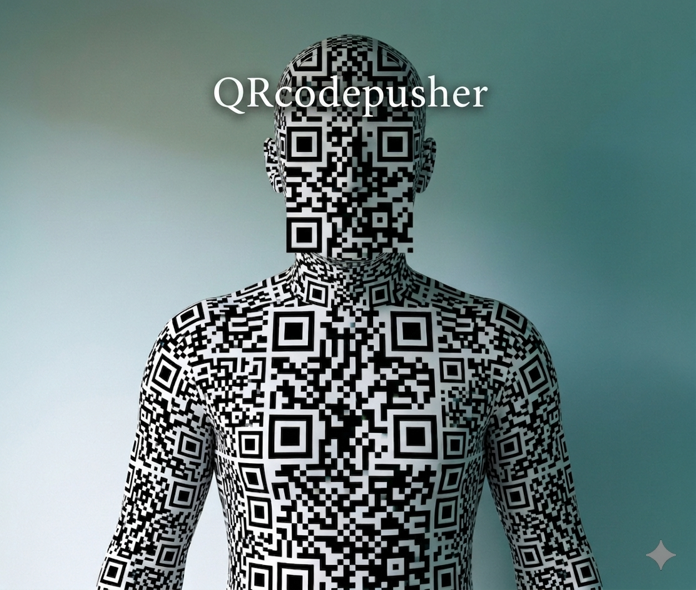

# QRcodepusher



このプロジェクトは、QRコードを利用してエアギャップ環境でもデータのやり取りが可能かどうかを調査するためのプロジェクトです。

## 使用方法

### ファイルを送信する
```bash
python3 -s -n file
```

### ファイルを受信する
```bash
python3 -r -n file
```

※ ファイル名を指定しない場合は、`data` というファイルが作成されます。

## ライセンス

このプロジェクトはMITライセンスの元で公開されています。詳細については、同梱されているLICENSEファイルを参照してください。